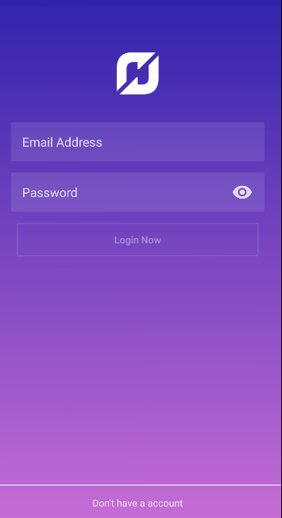
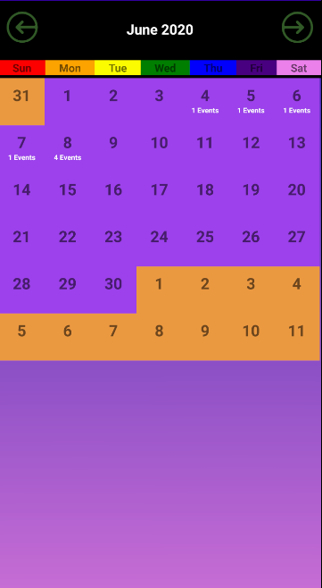
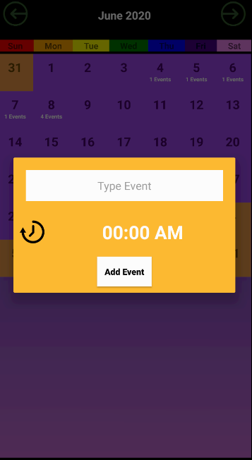
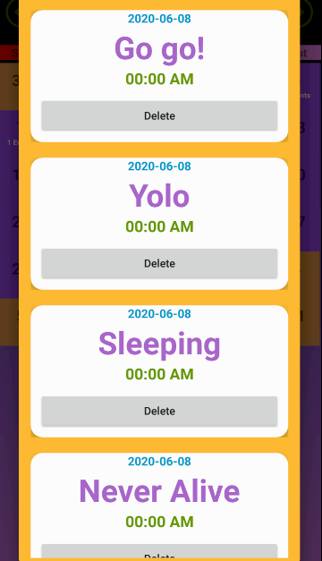

# MAD Assignment Checkpoint 1

Application Name: 

Group/Team: 5 

Team Members:
1) Lee Yoon Teng (S10198259D)
2) Anderson Loke Hou Ming (S10195290H)
3) James Yu Ren Xiang (S10195788B)

Introduction to the Application:
Our Daily Planner App allows users to add and delete events for organization of their schedules and it is also ads free.

Roles and Contribution:
1) Yoon Teng - Main Programmer (Created the database, Adding/Deleting/Viewing of Events)
2) Anderson - Sub Programmer/Designer (Created the Login and Registration Page and did the UI for both pages)
3) James - Main Desginer (Did the UI of the whole App) 

Future Plan/Upgrades:
1) Headlines (News/Weather) 
2) Notifications/Alarm 
3) Different styles for personalization (Male/Female) 
4) Daily Tips/Hacks (Motivational Quotes) 
5) Picture/Video Recording  
6) Stickers/Emoji Pack 
7) Road Planner/Google Map 
8) Birthday Reminders (Sync Contact)

Screenshots of Application:
1) Login Page  

2) Registration Page  

3) Home Page/Main Page  

4) Adding Event  

5) Viewing/Deleting Event  

