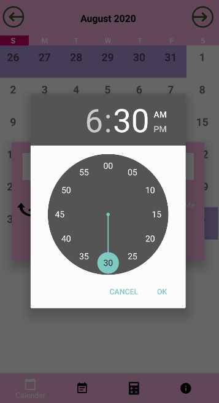

# MAD Assignment (Final)

Application Name: 

Group/Team: 5 

Team Members:
1) Lee Yoon Teng (S10198259D)
2) Anderson Loke Hou Ming (S10195290H)
3) James Yu Ren Xiang (S10195788B)

Introduction to the Application:
Our Daily Planner App allows users to add and delete events for organization of their schedules and it is also ads free.

Roles and Contribution:
1) Yoon Teng - Main Programmer
2) Anderson - Sub Programmer/Designer 
3) James - Main Desginer

Future Plan/Upgrades:
1) Headlines (News/Weather) 
2) Notifications/Alarm (Done)
3) Different styles for personalization (Male/Female) 
4) Daily Tips/Hacks (Motivational Quotes) 
5) Picture/Video Recording  
6) Stickers/Emoji Pack 
7) Road Planner/Google Map 
8) Birthday Reminders (Sync Contact)

Screenshots of Application:
1) Splashscreen  

2) Home Page/Main Page  
.png)

3) Adding Event  
.png)

4) Time Picker  

5) Viewing/Deleting Event  
.png)

6) Alarm  

7) Alarm Notification  

9) Note Taking  

9) Calculator  

10) Information  

Playstore Screenshots Submission (extra):

1) Icon for App  

2) Feature Graphic  

Screenshots of Other Designs for Calender:

1) Calendar Test 2  

2) Calendar Test 5  

